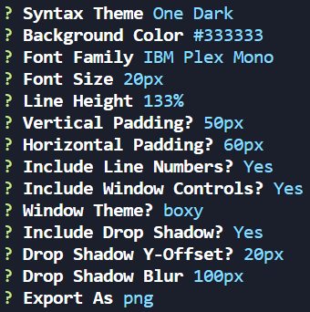
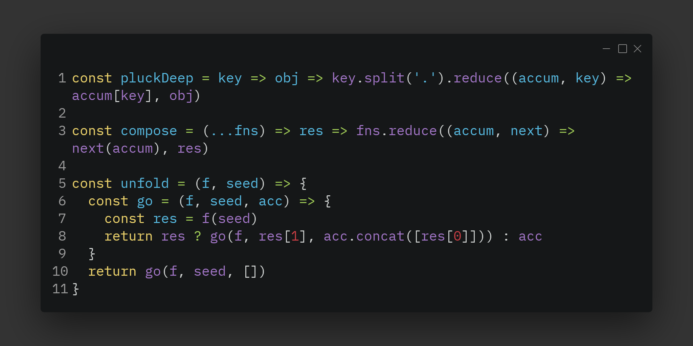

# carbon-image-cli

## 📃 Description
An unofficial, simple and basic CLI for capturing beautiful screenshots of your source code from carbon.now.sh.

## 📝 Usage

#### Sample Input

#### Sample Response

## 👨‍💻 Stack
